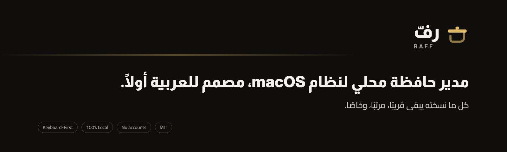
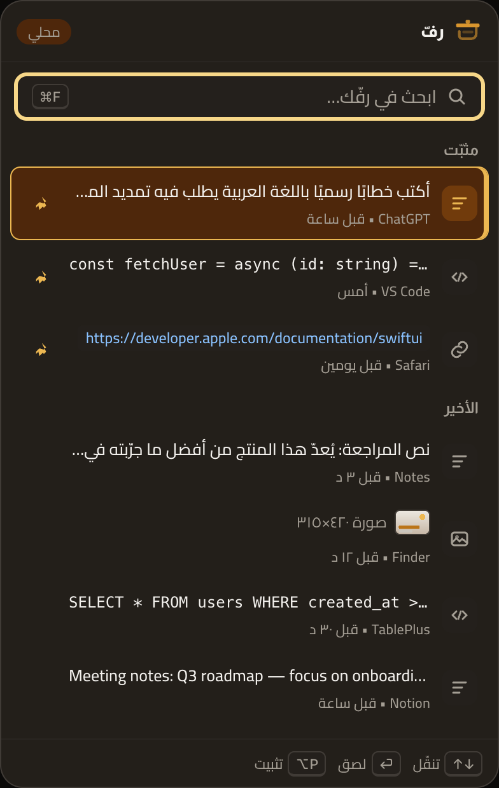
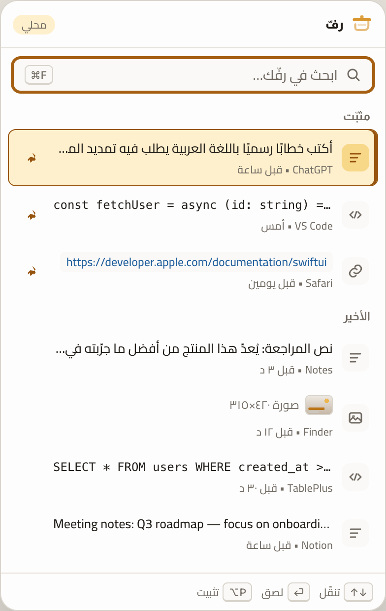
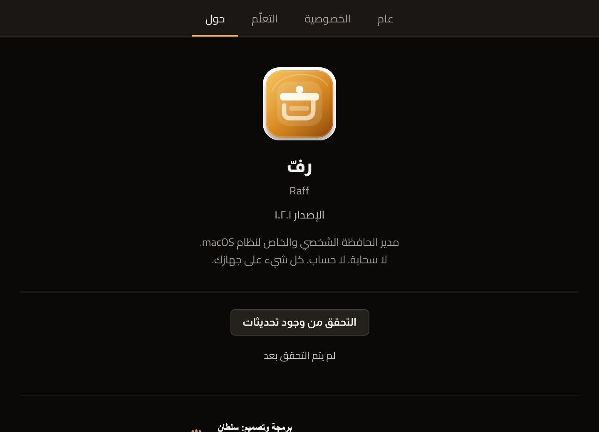
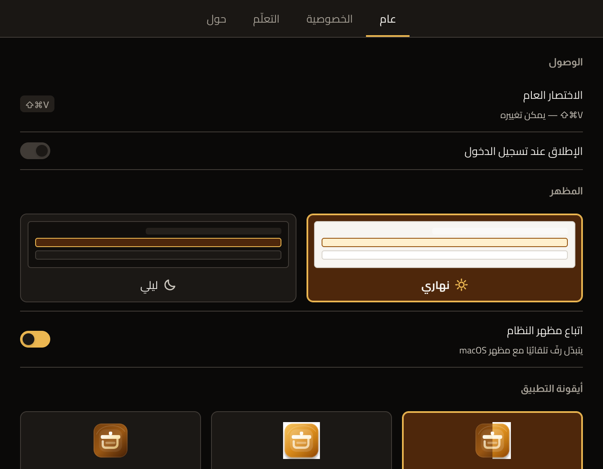
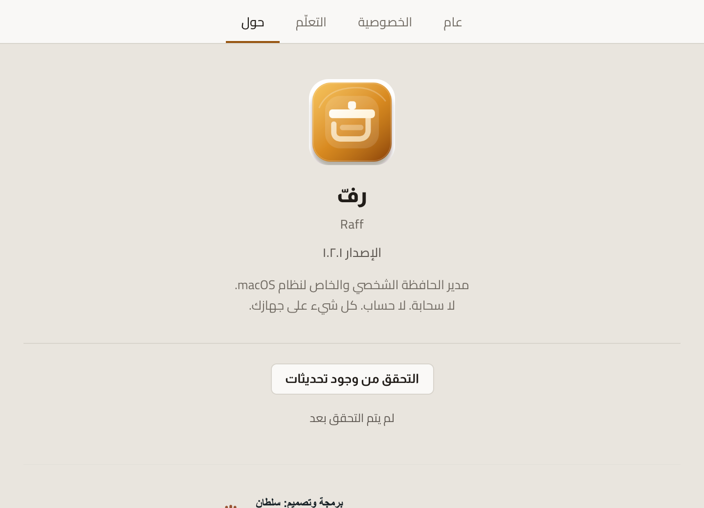
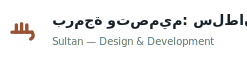

<div align="center">



**مدير الحافظة الشخصي والخاص لنظام macOS**

كل ما نسخته يبقى قريبًا، مرتبًا، وخاصًا.

[](https://github.com/iSltanX/Raff-releases/releases/latest)
[](https://github.com/iSltanX/Raff-releases/releases/latest)
[](#الخصوصية--local-first)

### [⬇︎ تنزيل أحدث إصدار](https://github.com/iSltanX/Raff-releases/releases/latest)

</div>

---

## ما هو رفّ

«رفّ» تطبيق صغير يسكن شريط القائمة في macOS، يحفظ ما تنسخه ويعيده إليك بضغطة
واحدة. يعمل على طبقتين:

- **الأخير** — سجل تلقائي لكل ما نسخته.
- **المثبّت** — رفّ دائم للنصوص والروابط والمقاطع التي تعيد استخدامها يوميًا.

بلا حساب، بلا سحابة، وبلا أي اتصال بالشبكة. كل بايت يبقى على جهازك.

<div align="center">


</div>

---

## أهم المميزات

- **لوحة عائمة فورية** تُفتح فوق أي تطبيق باختصار عام، وتُغلق فور اللصق.
- **بحث لحظي** يصفّي السجل أثناء الكتابة، ويتجاهل التشكيل والتطويل في العربية.
- **تثبيت العناصر** المهمة في قسم مستقل لا يزحف عليه السجل.
- **لصق مباشر** في التطبيق الذي كنت فيه، مع استعادة التركيز إليه.
- **لصق كنص عادي** لتجريد التنسيق عند الحاجة.
- **تحكّم كامل بالكيبورد** — لا حاجة للفأرة إطلاقًا.
- **الوضعان الفاتح والداكن**، مع اتباع مظهر النظام تلقائيًا.
- **واجهة عربية أصيلة** مبنية RTL من الأساس، لا معرّبة لاحقًا.
- **تحديث تلقائي موقّع** عبر قناة إصدارات معزولة عن بيانات الحافظة.

---

## الخصوصية — Local First

رفّ مصمَّم بحيث يستحيل عليه تسريب ما تنسخه، لا لأننا نَعِد بذلك، بل لأنه لا
يملك القدرة أصلًا:

- **صفر اتصالات شبكية** لبيانات الحافظة. الاتصال الوحيد الممكن هو التحقق من
  التحديثات عبر GitHub، وهو منفصل تمامًا ولا يحمل أي محتوى.
- **لا حسابات، ولا مزامنة، ولا تتبّع، ولا Telemetry.**
- **التخزين محلي وواضح**: ملفات JSON عادية في
  `~/Library/Application Support/com.raff.app/` والصور بجوارها كملفات PNG.
  يمكنك فتحها أو حذفها متى شئت.
- **احترام المحتوى المخفي**: ما يعلّمه مديرو كلمات المرور بـ
  `org.nspasteboard.ConcealedType` أو `AutoGeneratedType` **لا يُحفظ أبدًا**.
- **استبعاد التطبيقات**: أي تطبيق يمكن استثناؤه بالكامل من الالتقاط.
- **التعلّم اختياري وشفاف**: تسجيل صامت لعدّادات النسخ والاستخدام فقط، يمكن
  عرضه وتعطيله ومسحه من الإعدادات.

الإذن الوحيد الذي يطلبه رفّ هو **تسهيل الوصول (Accessibility)**، ولسبب واحد:
محاكاة ⌘V ليلصق نيابةً عنك. بدونه يظل كل شيء يعمل، لكن اللصق يصير يدويًا.

---

## أنواع المحتوى المدعومة

| النوع | السلوك |
| --- | --- |
| نص | يُحفظ ويُعرض بسطر واحد مختصر |
| رابط | يُعرض كشريحة مميّزة باتجاه LTR |
| كود | خط أحادي المسافة، باتجاه LTR، دون كسر التنسيق |
| صورة | مصغّرة داخل السجل، وتُخزَّن كملف PNG محلي |

---

## الاستخدام بالكيبورد

| الإجراء | المفتاح |
| --- | --- |
| فتح/إغلاق اللوحة | **⇧⌘V** (قابل للتغيير من الإعدادات) |
| تنقّل | ↑ ↓ — وPageUp/PageDown للقفز |
| لصق في التطبيق السابق | **⏎** |
| لصق كنص عادي | **⌥⏎** |
| تثبيت / إلغاء تثبيت | **⌥P** |
| بحث | اكتب مباشرة، أو **⌘F** |
| نسخ دون لصق | **⌘C** |
| حذف العنصر المحدد | **⌘⌫** |
| إغلاق — أو مسح البحث أولًا | **esc** |

تُفتح اللوحة في منتصف الشاشة التي عليها المؤشر، ويبدأ التركيز في حقل البحث
مباشرة.

---

## متطلبات النظام

- macOS 12 (Monterey) أو أحدث.
- معالج **Apple Silicon** (arm64). لا يتوفّر حاليًا بناء Intel.

---

## التثبيت

1. نزّل `Raff_2.0.0_aarch64.dmg` من
   [صفحة الإصدارات](https://github.com/iSltanX/Raff-releases/releases/latest).
2. افتح الملف واسحب **Raff** إلى مجلد التطبيقات.
3. شغّل رفّ. ستجده في **شريط القائمة** — لا تبحث عنه في Dock، فهو تطبيق
   خلفية بلا أيقونة Dock.

> [!IMPORTANT]
> **تنبيه Gatekeeper.** رفّ موقّع توقيعًا ذاتيًا (ad-hoc) وغير موثَّق من Apple
> (not notarized)، لأنه مشروع شخصي بلا حساب مطوّر مدفوع. لذلك قد يمنعه macOS
> في أول تشغيل برسالة تفيد بتعذّر التحقق من المطوّر.
>
> للتشغيل: انقر على أيقونة التطبيق بزر الفأرة الأيمن ← **فتح** ← ثم **فتح**
> مرة أخرى في الحوار. تكفي مرة واحدة فقط.
>
> إن استمر المنع، أزل علامة الحجر:
> ```sh
> xattr -dr com.apple.quarantine /Applications/Raff.app
> ```

---

## التحديث

يتحقق رفّ من التحديثات عبر قناة موقّعة على
[Raff-releases](https://github.com/iSltanX/Raff-releases). كل حزمة تحديث موقّعة
بمفتاح خاص، ويرفض التطبيق أي حزمة لا يتطابق توقيعها.

للتحديث يدويًا: **الإعدادات ← حول ← التحقق من وجود تحديثات**.

<div align="center">

</div>

---

## لقطات من الإصدار v2.0.0

<div align="center">

**الإعدادات — الوضع الداكن**



**نافذة حول — الوضع الفاتح**



</div>

> اللقطات مأخوذة من واجهة الإصدار v2.0.0 نفسها — الملفات المضمَّنة داخل
> `Raff.app` — وبيانات العناصر فيها عيّنة عرض لا محتوى حقيقي.

---

## معلومات الإصدار

| | |
| --- | --- |
| الإصدار الحالي | **v2.0.0** |
| المعمارية | macOS arm64 (Apple Silicon) |
| التوقيع | ad-hoc — غير موثَّق من Apple |
| قناة التحديث | Tauri Updater عبر Raff-releases |
| سجل التغييرات | [CHANGELOG.md](CHANGELOG.md) |

جوهر الإصدار v2.0.0 هو اعتماد نظام هوية «رفّ» البصري v2 على كامل الواجهة:
الألوان، الخطوط، الأيقونات، اللوحة العائمة، الإعدادات، ونافذة «حول».

---

## حالة المشروع

مستقرّ وقيد الاستخدام اليومي. المزايا الأساسية مكتملة: الالتقاط، السجل،
التثبيت، البحث، اللصق، الإعدادات، الخصوصية، والتحديث التلقائي. التطوير مدفوع
بالاستخدام الفعلي لا بجدول مزايا.

---

## البناء من المصدر

المتطلبات: macOS 12+، Rust (stable)، Node 18+، أدوات سطر أوامر Xcode.

```sh
npm install
npm run tauri dev     # تشغيل تطويري
npm run tauri build   # إنتاج Raff.app و‏.dmg
npm test              # اختبارات منطق الواجهة
cargo test --manifest-path src-tauri/Cargo.toml   # اختبارات الخلفية
```

### بنية المشروع

```
src/                 الواجهة (HTML/CSS/JS خام، RTL، فاتح + داكن)
  index.html         اللوحة العائمة          js/panel.js
  settings.html      الإعدادات و«حول»        js/settings.js
  firstrun.html      شاشة الأذونات           js/firstrun.js
  styles.css         Design Tokens (هوية رفّ v2)
  assets/            أصول الهوية الرسمية
src-tauri/           خلفية Rust
  src/monitor.rs     مراقبة الحافظة والالتقاط
  src/storage.rs     التخزين المحلي (JSON)
  src/paste.rs       استعادة التركيز ومحاكاة ⌘V
  src/panel.rs       NSPanel غير مُنشِّط + Vibrancy
  src/tray.rs        أيقونة شريط القائمة
  src/macos.rs       حدود AppKit
  src/commands.rs    واجهة IPC بأقل صلاحية
```

---

## الحقوق

جميع الحقوق محفوظة. «رفّ» وهويته البصرية عملٌ شخصي غير مرخَّص للاستخدام أو
إعادة التوزيع دون إذن.

<div align="center">
<br />

<picture>
  <source media="(prefers-color-scheme: dark)" srcset="docs/assets/sultan-rights-dark.svg" />
  
</picture>

</div>
