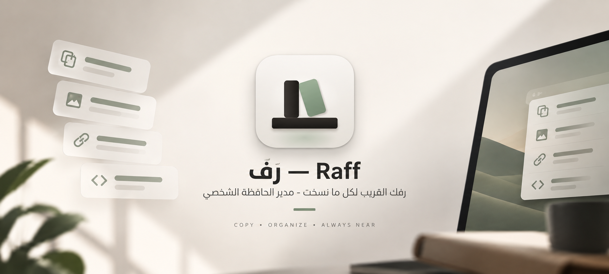
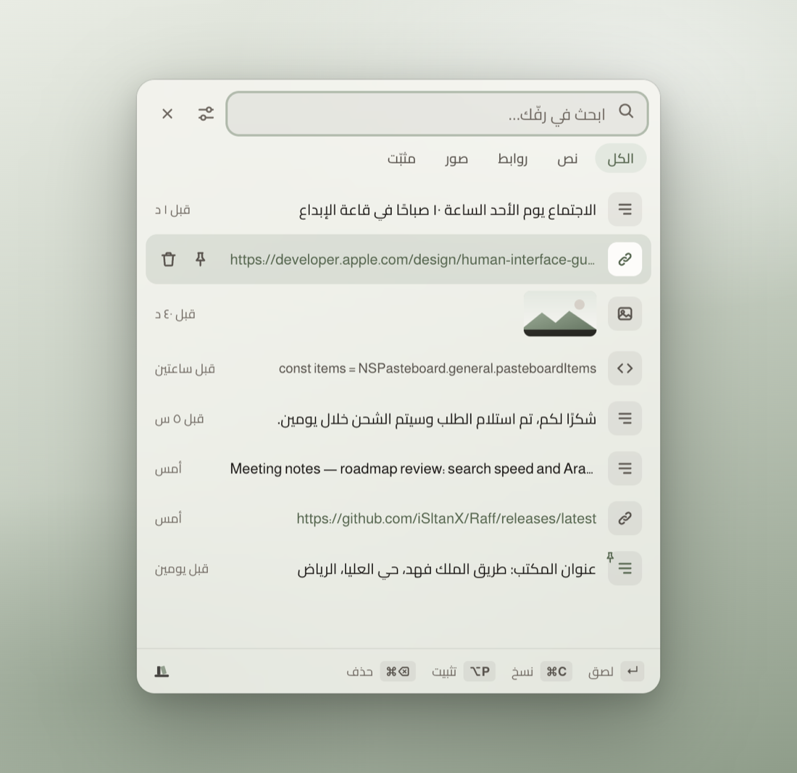
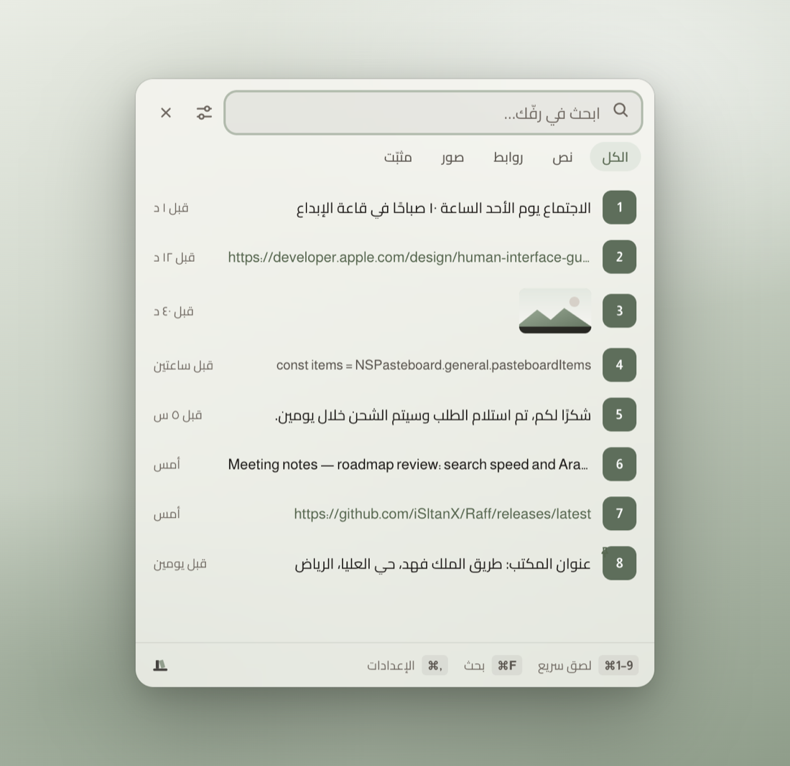
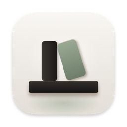

<div align="center">



**مدير حافظة عربي لنظام macOS — سريع، هادئ، وخاص بالكامل.**

[](https://github.com/iSltanX/Raff/releases/latest)
[](#المتطلبات)
[](#الخصوصية)

### [⬇︎ تنزيل أحدث إصدار](https://github.com/iSltanX/Raff/releases/latest)

</div>

---

## ما هو رفّ؟

الرفّ هو أبسط طريقة لإبقاء ما تحتاجه قريبًا ومرتبًا. و«رفّ» يطبّق الفكرة نفسها
على الحافظة: كل ما تنسخه يُحفظ تلقائيًا، ويعود إليك بضغطة واحدة من أي تطبيق.

يسكن رفّ شريط القوائم بلا أيقونة في Dock، ويرتّب ما تنسخه في طبقتين:

| الطبقة | ماذا تحفظ |
| --- | --- |
| **الأخير** | سجل تلقائي لكل ما نسخته — نصوص وروابط وشفرات وصور. |
| **المثبّت** | ما تختار إبقاءه دائمًا؛ لا يُحذف تلقائيًا مهما طال السجل. |

> رمز رفّ يرسم الفكرة نفسها: عنصر قائم هو «المثبّت»، وبطاقة تستند إليه هي «الأخير».

---

## لماذا رفّ؟

- **سريع من اللحظة الأولى** — تفتح اللوحة فورًا بـ <kbd>⇧⌘V</kbd> أو بنقرة على أيقونة شريط القوائم، والبحث يصفّي أثناء الكتابة.
- **لصق بإجراء واحد** — اختيار عنصر ينسخه، ويغلق اللوحة، ويلصقه مباشرة في التطبيق الذي كنت فيه.
- **لصق سريع بالأرقام** — أمسك <kbd>⌘</kbd> لتظهر الأرقام، ثم <kbd>⌘1</kbd>…<kbd>⌘9</kbd> للصق أي عنصر من أول تسعة.
- **خاص بالكامل** — بلا حساب ولا سحابة ولا تتبّع. بيانات الحافظة لا تغادر جهازك أبدًا.
- **عربي أصيل** — واجهة مبنية من اليمين إلى اليسار من الأساس، وبحث يتجاهل التشكيل والتطويل.
- **يحترم macOS** — خلفية زجاجية أصلية، ووضعان فاتح وداكن يتبعان النظام.

---

## جولة سريعة

<div align="center">
<picture>
  <source media="(prefers-color-scheme: dark)" srcset="docs/assets/raff-panel-dark.png">
  
</picture>
</div>

<br />

<table>
  <tr>
    <td width="50%" align="center">
      <br />
      <b>اللصق السريع</b><br />
      أمسك ⌘ لتظهر أرقام أول تسعة عناصر.
    </td>
    <td width="50%" align="center">
      <br />
      <b>بحث فوري</b><br />
      النتائج تتصفّى أثناء الكتابة، في النصوص والروابط والصور.
    </td>
  </tr>
</table>

<div align="center">
<picture>
  <source media="(prefers-color-scheme: dark)" srcset="docs/assets/raff-settings-dark.png">
  
</picture>
</div>

---

## الاختصارات

| الإجراء | المفتاح |
| --- | --- |
| فتح اللوحة وإغلاقها (من أي مكان) | <kbd>⇧⌘V</kbd> — قابل للتغيير من الإعدادات |
| التنقّل بين العناصر | <kbd>↑</kbd> <kbd>↓</kbd> — و<kbd>PageUp</kbd> <kbd>PageDown</kbd> للقفز |
| لصق العنصر المحدد | <kbd>⏎</kbd> |
| لصق كنص عادي بلا تنسيق | <kbd>⌥⏎</kbd> |
| لصق سريع لأحد أول تسعة عناصر | <kbd>⌘1</kbd> … <kbd>⌘9</kbd> |
| نسخ دون لصق | <kbd>⌘C</kbd> |
| تثبيت / إلغاء التثبيت | <kbd>⌥P</kbd> |
| حذف العنصر | <kbd>⌘⌫</kbd> |
| التراجع عن الحذف (خلال ٥ ثوانٍ) | <kbd>⌘Z</kbd> |
| البحث | اكتب مباشرة، أو <kbd>⌘F</kbd> |
| الإعدادات | <kbd>⌘,</kbd> |
| مسح البحث، ثم الإغلاق | <kbd>Esc</kbd> |

النقر على عنصر يساوي تحديده ثم <kbd>⏎</kbd>، والنقر مع <kbd>⌥</kbd> يلصقه كنص عادي.
النقر الأيمن على أيقونة شريط القوائم يفتح قائمة: الإعدادات، التحقق من التحديثات، عن رفّ، إنهاء.

---

## التثبيت

1. نزّل ملف `Raff_<الإصدار>_aarch64.dmg` من [صفحة الإصدارات](https://github.com/iSltanX/Raff/releases/latest).
2. افتحه واسحب **Raff** إلى مجلد **التطبيقات**.
3. شغّل رفّ، وستجد أيقونته في **شريط القوائم**.
4. في أول تشغيل يطلب رفّ إذن **تسهيل الوصول** — وهو مطلوب للّصق التلقائي فقط.

> [!IMPORTANT]
> **تنبيه Gatekeeper:** رفّ موقّع ذاتيًا وغير موثَّق من Apple لأنه مشروع شخصي،
> لذلك قد يرفض macOS تشغيله أول مرة.
> انقر على التطبيق بالزر الأيمن ← **فتح** ← **فتح**. تكفي مرة واحدة.
>
> إن استمر المنع:
> ```sh
> xattr -dr com.apple.quarantine /Applications/Raff.app
> ```

---

## التحديث

يتحقق رفّ من التحديثات عبر [إصدارات هذا المستودع](https://github.com/iSltanX/Raff/releases).
كل حزمة تحديث موقّعة، ويرفض التطبيق أي حزمة لا يتطابق توقيعها.

للتحقق يدويًا: **النقر الأيمن** على أيقونة رفّ ← **التحقق من التحديثات…**
أو من **الإعدادات ← حول ← التحقق الآن**.

---

## الخصوصية

رفّ مصمَّم بحيث لا يملك طريقًا لتسريب ما تنسخه:

- **صفر اتصالات لبيانات الحافظة.** الاتصال الوحيد هو التحقق من التحديثات، ولا يحمل أي محتوى.
- **لا حسابات، ولا مزامنة، ولا تتبّع.**
- **تخزين محلي مفهوم:** ملفات JSON وصور PNG داخل `~/Library/Application Support/com.raff.app/`، يمكنك فتحها أو حذفها متى شئت.
- **المحتوى السرّي لا يُحفظ:** ما يعلّمه مديرو كلمات المرور كمحتوى مخفي يُتجاهل تلقائيًا.
- **استثناء التطبيقات:** لا يُلتقط ما يُنسخ من تطبيق مستثنى وهو التطبيق الأمامي.
  نسخة تصدر من عملية في الخلفية — `pbcopy` من طرفية غير ظاهرة مثلًا — لا يستطيع
  macOS نسبتها إلى تطبيق بعينه، فتبقى خارج ما يغطّيه الاستثناء.
- **التعلّم اختياري ومحلي:** عدّادات استخدام بسيطة لترتيب ما تستخدمه أكثر، يمكن عرضها ومسحها وإيقافها.

الإذن الوحيد الذي يطلبه رفّ هو **تسهيل الوصول**، لمحاكاة <kbd>⌘V</kbd> عند اللصق. بدونه
يبقى كل شيء يعمل، ويُنسخ العنصر إلى الحافظة لتلصقه بنفسك.

---

## المتطلبات

- macOS 12 (Monterey) أو أحدث — مُختبَر حتى **macOS 27**.
- معالج **Apple Silicon**.

---

## للمطوّرين

**المتطلبات:** Rust (stable)، Node 20+، أدوات سطر أوامر Xcode.

```sh
npm install
npm run tauri dev       # تشغيل تطويري
npm run tauri build     # بناء Raff.app و‏.dmg
npm test                # اختبارات الواجهة
cargo test --manifest-path src-tauri/Cargo.toml   # اختبارات الخلفية
npm run icons           # توليد الأيقونات من الأصول المعتمدة
```

<details>
<summary><b>بنية المشروع</b></summary>

```
src/                    الواجهة (HTML/CSS/JS، RTL، فاتح وداكن)
  index.html            اللوحة العائمة             js/panel.js
  settings.html         الإعدادات                  js/settings.js
  about.html            عن رفّ                     js/about.js
  update.html           التحديث                    js/update.js
  firstrun.html         إذن تسهيل الوصول           js/firstrun.js
  tokens.css            ألوان الهوية والخطوط والمقاسات
  controls.css          المكوّنات المشتركة
  assets/icons/         أيقونات الواجهة (16px)
  assets/brand/         رمز رفّ وأيقونة شريط القوائم
src-tauri/src/          الخلفية (Rust)
  panel.rs              اللوحة العائمة (NSPanel)
  tray.rs               أيقونة شريط القوائم (NSStatusItem)
  monitor.rs            مراقبة الحافظة والالتقاط
  storage.rs            التخزين المحلي
  paste.rs              استعادة التركيز واللصق
  commands.rs           واجهة الأوامر والنوافذ
  updater.rs            التحديث الموقّع
scripts/                بناء الواجهة، توليد الأيقونات، وخط الإصدار
tests/                  اختبارات السلوك وعقد الهوية
```

</details>

الإصدارات تُبنى تلقائيًا عبر GitHub Actions عند دفع وسم بصيغة `vX.Y.Z`.
سجل التغييرات الكامل في [CHANGELOG.md](CHANGELOG.md).

---

## الإبلاغ عن مشكلة

افتح مسألة في [صفحة المسائل](https://github.com/iSltanX/Raff/issues) مع:
إصدار رفّ (من **الإعدادات ← حول**)، وإصدار macOS، وخطوات إعادة المشكلة.

> لا تُرفق محتوى حافظة خاصًا — ما تكتبه في المسألة يصبح علنيًا.

---

<div align="center">



**تطوير وتصميم: سلطان** · Developed & Designed by Sultan

جميع الحقوق محفوظة. «رفّ» وهويته البصرية عمل شخصي غير مرخَّص للاستخدام أو إعادة التوزيع دون إذن.

</div>
