<div align="center">

<picture>
  <source media="(prefers-color-scheme: dark)" srcset="docs/assets/raff-hero-dark.png">
  <source media="(prefers-color-scheme: light)" srcset="docs/assets/raff-hero-light.png">
  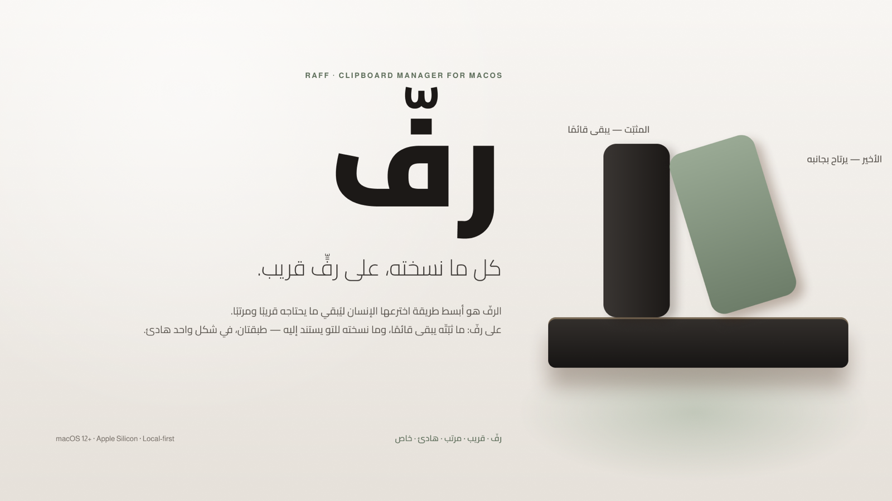
</picture>

**مدير الحافظة الشخصي والخاص لنظام macOS**

كل ما نسخته يبقى قريبًا، مرتبًا، وخاصًا.

[](https://github.com/iSltanX/Raff/releases/latest)
[](https://github.com/iSltanX/Raff/releases/latest)
[](#الخصوصية--local-first)

### [⬇︎ تنزيل أحدث إصدار](https://github.com/iSltanX/Raff/releases/latest)

</div>

---

## ما هو رفّ

«رفّ» — الكلمة العربية للرفّ الذي تضع عليه أغراضك لتبقى قريبة ومرتّبة — تطبيق
صغير يسكن شريط القائمة في macOS، يحفظ ما تنسخه ويعيده إليك بضغطة واحدة. يعمل
على طبقتين:

- **الأخير** — سجل تلقائي لكل ما نسخته.
- **المثبّت** — ما تثبّته يبقى على الرفّ ولا يُحذف تلقائيًا، ويظهر معلّمًا بين
  عناصرك أو وحده عبر تصفية «مثبّت».

بلا حساب، بلا سحابة، وبلا أي اتصال بالشبكة. كل بايت يبقى على جهازك.

<div align="center">
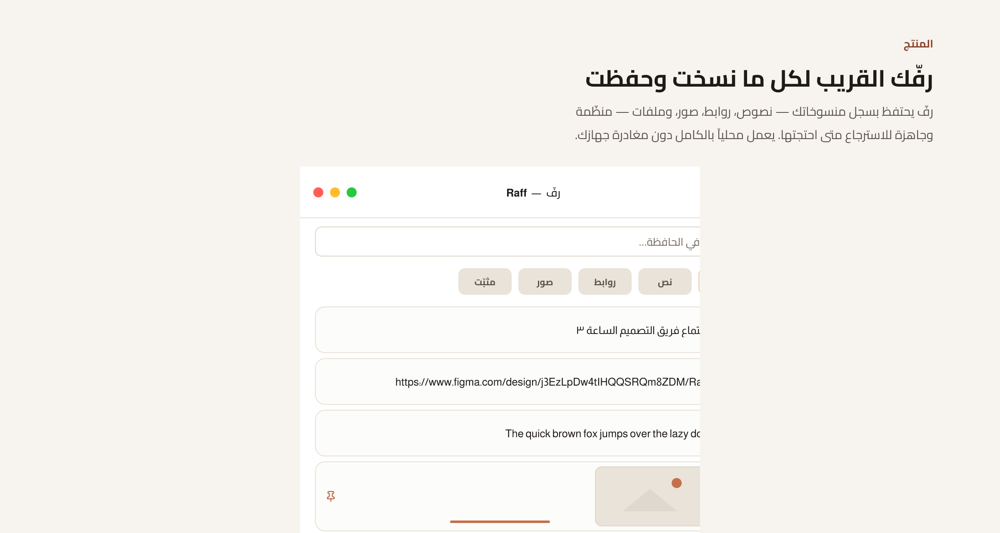
</div>

---

## أهم المميزات

<div align="center">
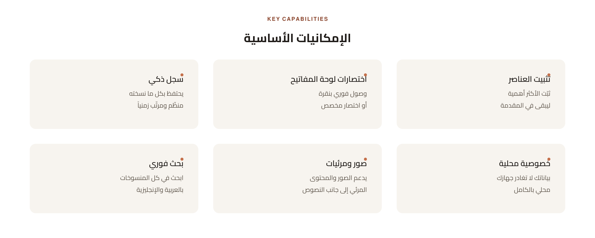
</div>

- **لوحة عائمة فورية** تُفتح بنقرة على أيقونة شريط القائمة أو باختصار عام، فوق أي تطبيق.
- **اختيار العنصر إجراء واحد**: نقرة واحدة (أو ⏎) تنسخ العنصر، تُغلق رفّ، تعيد
  التركيز إلى التطبيق الذي كنت فيه، وتلصقه هناك مباشرة — والعنصر نفسه يبقى في
  الحافظة بعدها، فتلصقه مجددًا بـ ⌘V وقتما شئت.
- **تصفية فورية** بين الكل والنصوص والروابط والصور والمثبّت.
- **بحث لحظي** يصفّي السجل أثناء الكتابة، ويتجاهل التشكيل والتطويل في العربية.
- **تثبيت العناصر** المهمة داخل القائمة الزمنية نفسها، مع تصفية «مثبّت» للوصول السريع.
- **إجراءات صف واضحة** للتثبيت والحذف، مع تراجع آمن لمدة خمس ثوانٍ وشريط اختصارات سياقي.
- **لصق كنص عادي** (⌥ مع النقر أو ⌥⏎) لتجريد التنسيق عند الحاجة.
- **نسخ بلا لصق** (⌘C) حين تريد العنصر في الحافظة فقط.
- **تحكّم كامل بالكيبورد** — لا حاجة للفأرة إطلاقًا.
- **الوضعان الفاتح والداكن**، مع اتباع مظهر النظام تلقائيًا.
- **واجهة عربية أصيلة** مبنية RTL من الأساس، لا معرّبة لاحقًا.
- **تحديث تلقائي موقّع** عبر قناة إصدارات معزولة عن بيانات الحافظة.

---

## الواجهة

اللوحة تتبع مظهر macOS تلقائيًا حين يكون إعداد المظهر على **تلقائي** — فاتحة
حين يكون نظامك فاتحًا، داكنة حين يكون داكنًا — أو يمكن تثبيتها على أحد
الوضعين من الإعدادات بصرف النظر عن مظهر النظام.

<div align="center">

<picture>
  <source media="(prefers-color-scheme: dark)" srcset="docs/assets/raff-dark-mode.png">
  <source media="(prefers-color-scheme: light)" srcset="docs/assets/raff-light-mode.png">
  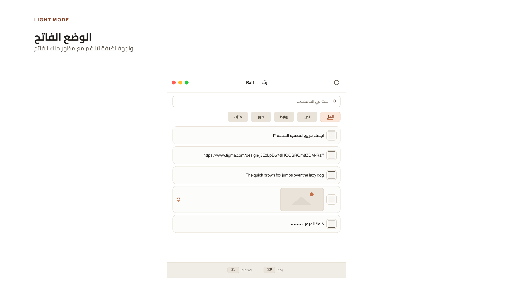
</picture>

<br /><br />

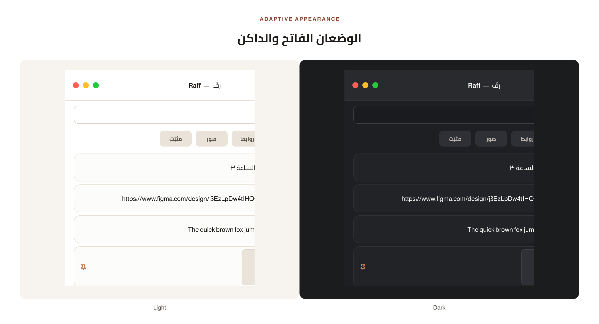

</div>

---

## بحث فوري

<div align="center">
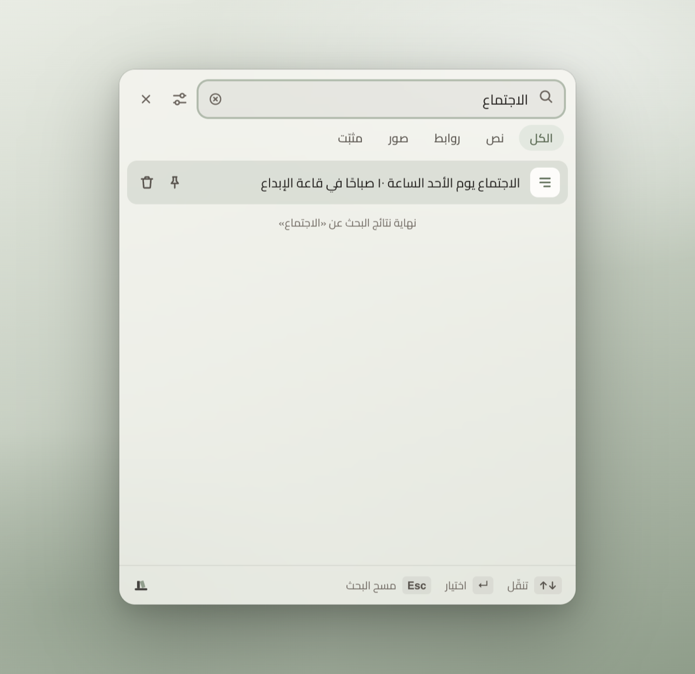
</div>

ابدأ بالكتابة وستظهر النتائج فورًا — عبر النصوص والروابط والصور معًا. البحث
العربي يتجاهل التشكيل والتطويل، فلا يفوتك عنصر بسبب حركة أو حرف ممدود.

---

## العناصر المثبّتة

<div align="center">
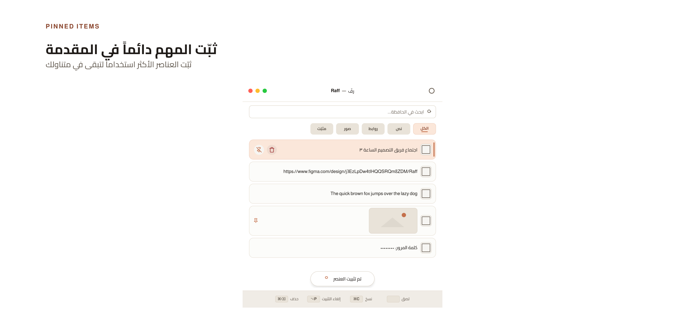
</div>

ثبّت العناصر الأكثر استخدامًا لتبقى في متناولك — معلّمة داخل القائمة الزمنية
نفسها، أو مصفّاة وحدها عبر «مثبّت»، دون أن تُحذف تلقائيًا مهما طال الوقت.

---

## دعم الصور

<div align="center">
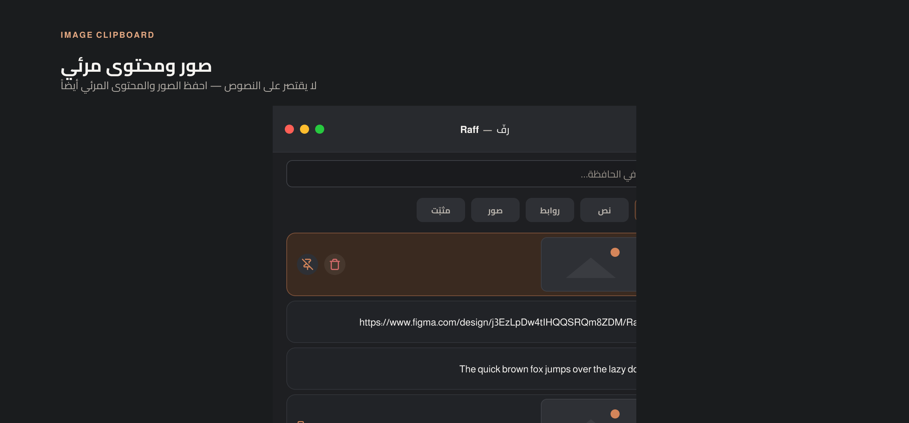
</div>

رفّ لا يقتصر على النصوص. الصور المنسوخة تُحفظ بمعاينة مصغّرة داخل السجل، وتُخزَّن
كملفات PNG محلية بجوار بقية بياناتك — لا رفع، ولا سحابة.

---

## شريط القائمة

<div align="center">
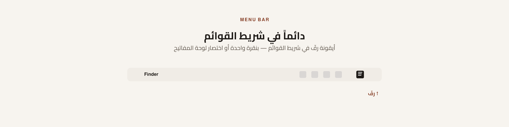
</div>

أيقونة رفّ تعيش في شريط القوائم — نقرة واحدة أو اختصار لوحة المفاتيح يفتح
اللوحة فوق أي تطبيق أنت فيه. رفّ تطبيق خلفية بلا أيقونة Dock.

---

## أيقونة التطبيق

<div align="center">
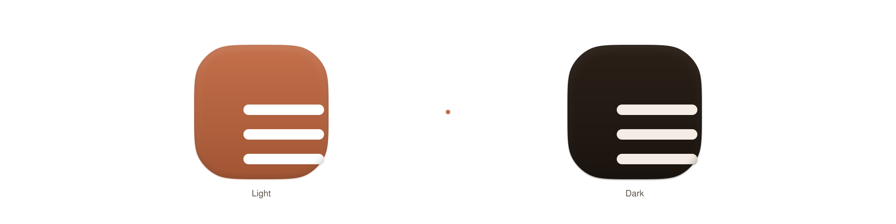
</div>

أيقونة رفّ التي تراها في Finder وDock وDMG هي **النسخة الفاتحة دائمًا**، بصرف
النظر عن مظهر macOS الحالي — لا تبديل، لا إعادة تشغيل، ولا أيقونة داكنة نشطة.
هذا اختيار مقصود لهوية بصرية واحدة ثابتة. المعالجة الداكنة المعروضة أعلاه جزء
من نظام الهوية البصرية المعتمد في Figma، محفوظة كأصل تصميم جاهز، دون أن تكون
مفعّلة كأيقونة تطبيق متغيّرة. مظهر **واجهة** رفّ نفسها — اللوحة والإعدادات —
منفصل تمامًا ويتبع إعداد المظهر أو نظامك كما هو موضّح أعلاه.

---

## الهوية البصرية

هوية رفّ البصرية — الألوان، الخطوط، الأيقونات، ومكوّنات الواجهة وشاشات
المنتج — مبنية بالكامل من نظام تصميم معتمد في Figma:
[رفّ — Raff Brand Identity & Product Design System](https://www.figma.com/design/j3EzLpDw4tIHQQSRQm8ZDM/%D8%B1%D9%81%D9%91-%E2%80%94-Raff-Brand-Identity---Product-Design-System).
اللون الأساسي **Terracotta ‏#C4704B**. الخطوط المعتمدة: **Cairo** للنصوص
العربية والعناوين، **Almarai** للنصوص اللاتينية والأرقام ورموز لوحة
المفاتيح. Design tokens الكاملة (ألوان الوضعين الفاتح والداكن، تباعد،
انحناءات، ارتفاعات، سلّم الطباعة) في
[src/tokens.css](src/tokens.css)، والمكوّنات المشتركة في
[src/controls.css](src/controls.css). لقطات هذا الملف مصدَّرة مباشرة من
صفحة «GitHub & README» المعتمدة في الملف نفسه.

---

## الخصوصية — Local First

<div align="center">

</div>

رفّ مصمَّم بحيث يستحيل عليه تسريب ما تنسخه، لا لأننا نَعِد بذلك، بل لأنه لا
يملك القدرة أصلًا:

- **صفر اتصالات شبكية** لبيانات الحافظة. الاتصال الوحيد الممكن هو التحقق من
  التحديثات عبر GitHub، وهو منفصل تمامًا ولا يحمل أي محتوى.
- **لا حسابات، ولا مزامنة، ولا تتبّع، ولا Telemetry.**
- **التخزين محلي وواضح**: ملفات JSON عادية في
  `~/Library/Application Support/com.raff.app/` والصور بجوارها كملفات PNG.
  يمكنك فتحها أو حذفها متى شئت.
- **احترام المحتوى المخفي**: ما يعلّمه مديرو كلمات المرور بـ
  `org.nspasteboard.ConcealedType` أو `AutoGeneratedType` **لا يُحفظ أبدًا**.
- **استبعاد التطبيقات**: أي تطبيق يمكن استثناؤه بالكامل من الالتقاط.
- **التعلّم اختياري وشفاف**: تسجيل صامت لعدّادات النسخ والاستخدام فقط، يمكن
  عرضه وتعطيله ومسحه من الإعدادات.

الإذن الوحيد الذي يطلبه رفّ هو **تسهيل الوصول (Accessibility)**، ولسبب واحد:
محاكاة ⌘V ليلصق نيابةً عنك بعد اختيار عنصر. بدونه يظل كل شيء يعمل — العنصر
يُنسخ إلى الحافظة دائمًا — لكن اللصق يصير يدويًا (⌘V)، ويعرض رفّ زر منح الإذن
مباشرة في تلك اللحظة إن أردت تفعيل اللصق التلقائي.

---

## أنواع المحتوى المدعومة

| النوع | السلوك |
| --- | --- |
| نص | يُحفظ ويُعرض بسطر واحد مختصر |
| رابط | يُعرض بلون الهوية باتجاه LTR |
| كود | يُعرض كالنص مع الحفاظ على اتجاهه الأصلي |
| صورة | معاينة مصغّرة داخل السجل، وتُخزَّن كملف PNG محلي |

---

## الاستخدام بالكيبورد

<div align="center">
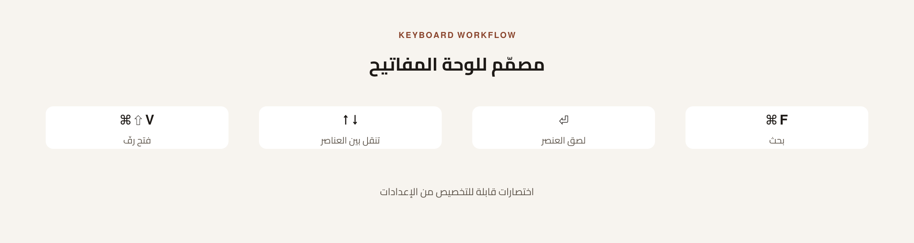
</div>

| الإجراء | المفتاح |
| --- | --- |
| فتح/إغلاق اللوحة | **⇧⌘V** (قابل للتغيير من الإعدادات) |
| تنقّل | ↑ ↓ — وPageUp/PageDown للقفز |
| لصق في التطبيق السابق | **⏎** |
| لصق كنص عادي | **⌥⏎** |
| تثبيت / إلغاء تثبيت | **⌥P** |
| بحث | اكتب مباشرة، أو **⌘F** |
| نسخ دون لصق | **⌘C** |
| حذف العنصر المحدد | **⌘⌫** |
| التراجع عن حذف العنصر | **⌘Z** خلال مهلة التراجع |
| إغلاق — أو مسح البحث أولًا | **esc** |

تُفتح اللوحة في منتصف الشاشة التي عليها المؤشر في أول استخدام، ثم تتذكر
موضعها بعد سحبها وتعيده ضمن حدود مساحة العمل المرئية. يبدأ التركيز في حقل
البحث مباشرة.

الفأرة والكيبورد يعنيان الإجراء نفسه: النقر على عنصر يكافئ تحديده ثم الضغط
على ⏎ — النتيجة واحدة في الحالتين.

---

## الإعدادات والتحكم

<div align="center">
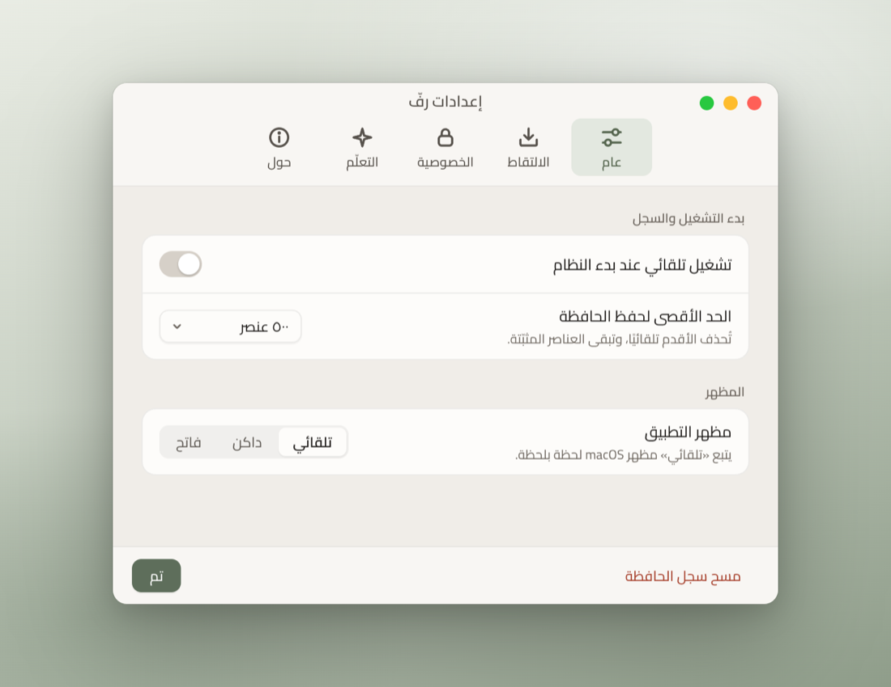
</div>

نافذة إعدادات مستقلة تجمع كل ضبط في مكان واحد: حجم السجل المحفوظ، اختصار فتح
اللوحة، التشغيل التلقائي عند الدخول، مظهر الواجهة (تلقائي / فاتح / داكن)،
وضوابط الخصوصية — استبعاد التطبيقات، احترام المحتوى المخفي، وتفعيل التعلّم
الاختياري أو تعطيله.

---

## متطلبات النظام

- macOS 12 (Monterey) أو أحدث.
- معالج **Apple Silicon** (arm64). لا يتوفّر حاليًا بناء Intel.

---

## التثبيت

<div align="center">
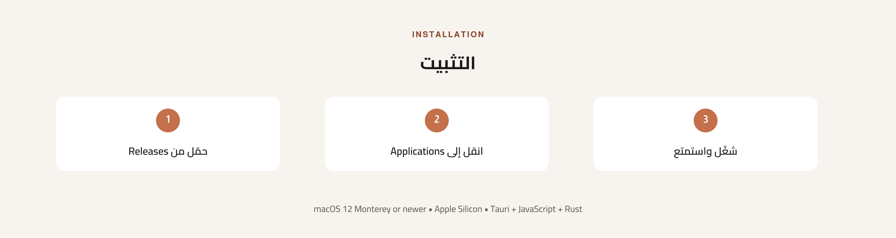
</div>

1. نزّل `Raff_4.2.1_aarch64.dmg` من
   [صفحة الإصدارات](https://github.com/iSltanX/Raff/releases/latest).
2. افتح الملف واسحب **Raff** إلى مجلد التطبيقات.
3. شغّل رفّ. ستجده في **شريط القائمة** — لا تبحث عنه في Dock، فهو تطبيق
   خلفية بلا أيقونة Dock.

> [!IMPORTANT]
> **تنبيه Gatekeeper.** رفّ موقّع توقيعًا ذاتيًا (ad-hoc) وغير موثَّق من Apple
> (not notarized)، لأنه مشروع شخصي بلا حساب مطوّر مدفوع. لذلك قد يمنعه macOS
> في أول تشغيل برسالة تفيد بتعذّر التحقق من المطوّر.
>
> للتشغيل: انقر على أيقونة التطبيق بزر الفأرة الأيمن ← **فتح** ← ثم **فتح**
> مرة أخرى في الحوار. تكفي مرة واحدة فقط.
>
> إن استمر المنع، أزل علامة الحجر:
> ```sh
> xattr -dr com.apple.quarantine /Applications/Raff.app
> ```

---

## التحديث

يتحقق رفّ من التحديثات عبر قناة موقّعة على
[صفحة إصدارات رفّ](https://github.com/iSltanX/Raff/releases). كل حزمة تحديث
موقّعة بمفتاح خاص، ويرفض التطبيق أي حزمة لا يتطابق توقيعها.

للتحديث يدويًا: انقر بزر الفأرة الأيمن على أيقونة رفّ في شريط القائمة ← **التحقق من التحديثات**.

---

## معلومات الإصدار

<div align="center">

</div>

| | |
| --- | --- |
| الإصدار الحالي | **v4.2.1** |
| المعمارية | macOS arm64 (Apple Silicon) |
| التوقيع | ad-hoc — غير موثَّق من Apple |
| قناة التحديث | Tauri Updater عبر إصدارات هذا المستودع |
| سجل التغييرات | [CHANGELOG.md](CHANGELOG.md) |

v4.2.1 يغيّر طريقة استخدام رفّ اليومية: اختيار عنصر أصبح إجراءً واحدًا
(نسخ ← إغلاق رفّ ← إعادة تفعيل التطبيق السابق ← لصق تلقائي — والعنصر يبقى في
الحافظة بعدها)، مع رجوع آمن للنسخ فقط حين لا يتوفر إذن تسهيل الوصول. اللوحة
تفتح فورًا من أول استخدام بعد تشغيل رفّ — أُصلح خلل كان يجعل النقرات الأولى
غير مستجيبة لعشرات الثواني أحيانًا. أيقونة التطبيق الفاتحة الآن ثابتة فعليًا
في الوضعين الفاتح والداكن على macOS الحديث، مبنية عبر خط أنابيب إصدار مصحَّح.
لا تغيير في البيانات المحفوظة ولا في آلية الالتقاط؛ راجع
[CHANGELOG.md](CHANGELOG.md) للتفاصيل الكاملة.

---

## حالة المشروع

مستقرّ وقيد الاستخدام اليومي. المزايا الأساسية مكتملة: الالتقاط، السجل،
التثبيت، البحث، اللصق، الإعدادات، الخصوصية، والتحديث التلقائي. التطوير مدفوع
بالاستخدام الفعلي لا بجدول مزايا.

---

## البناء من المصدر

المتطلبات: macOS 12+، Rust (stable)، Node 18+، أدوات سطر أوامر Xcode.

```sh
npm install
npm run tauri dev     # تشغيل تطويري
npm run tauri build   # إنتاج Raff.app و‏.dmg
npm test              # اختبارات منطق الواجهة
cargo test --manifest-path src-tauri/Cargo.toml   # اختبارات الخلفية
```

### بنية المشروع

```
src/                 مصدر الواجهة (HTML/CSS/JS خام، RTL، فاتح + داكن)
  index.html         اللوحة العائمة          js/panel.js
  settings.html      الإعدادات               js/settings.js
  about.html         نافذة «عن رفّ»          js/about.js
  update.html        نافذة التحديث           js/update.js
  firstrun.html      شاشة الأذونات           js/firstrun.js
  theme.js           مزامنة مظهر الواجهة مع النظام عند «تلقائي»
  tokens.css         Design Tokens (هوية رفّ v4 — فاتح + داكن)
  controls.css       المكوّنات المشتركة (أزرار، لوحات تمرير، مفاتيح)
  js/icons.js        أيقونات المنتج المصدّرة من Figma
  assets/            أصول الهوية الرسمية (أيقونة التطبيق، شريط القائمة)
docs/assets/          لقطات ورسوم README مصدَّرة من صفحة Figma «GitHub & README»
dist/                حمولة إنتاجية مولّدة من قائمة ملفات مسموحة صريحة
scripts/
  build-frontend.mjs يبني dist/ ويمنع شحن mocks وصادرات العرض من Figma
  gen-icons.mjs      يولّد أيقونات الحزمة من المصدر المعتمد (مصدَّر مباشرة من Figma)
src-tauri/           خلفية Rust
  src/monitor.rs     مراقبة الحافظة والالتقاط
  src/storage.rs     التخزين المحلي (JSON)
  src/paste.rs       استعادة التركيز ومحاكاة ⌘V
  src/panel.rs       NSPanel غير مُنشِّط
  src/tray.rs        أيقونة شريط القائمة
  src/macos.rs       حدود AppKit
  src/commands.rs    واجهة IPC بأقل صلاحية
```

---

## الإبلاغ عن المشكلات

للإبلاغ عن خلل أو اقتراح تحسين، افتح مسألة جديدة على
[صفحة المسائل](https://github.com/iSltanX/Raff/issues).

يفيد إرفاق: إصدار رفّ (من **الإعدادات ← حول**)، وإصدار macOS، وخطوات إعادة
إنتاج المشكلة. لا ترفق محتوى حافظة تعتبره خاصًا — رفّ لا يرسل شيئًا تلقائيًا،
وما تكتبه في المسألة يصير علنيًا.

---

## الحقوق

جميع الحقوق محفوظة. «رفّ» وهويته البصرية عملٌ شخصي غير مرخَّص للاستخدام أو
إعادة التوزيع دون إذن.

<div align="center">

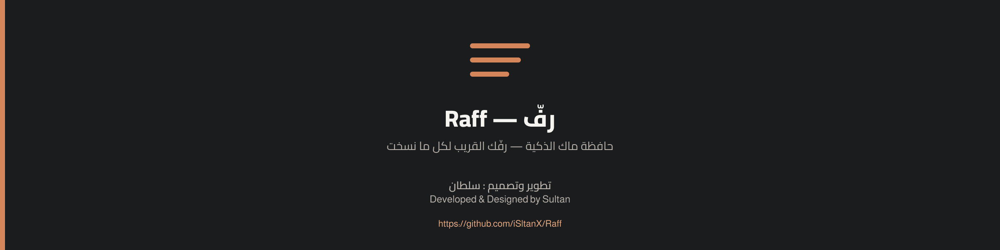

<br />

**تطوير وتصميم : سلطان**

Developed & Designed by Sultan

</div>
