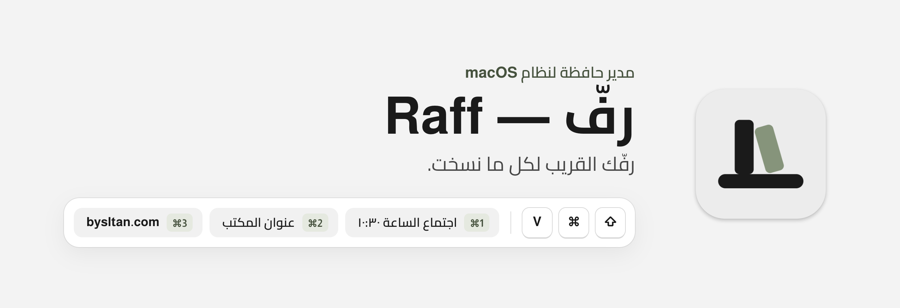
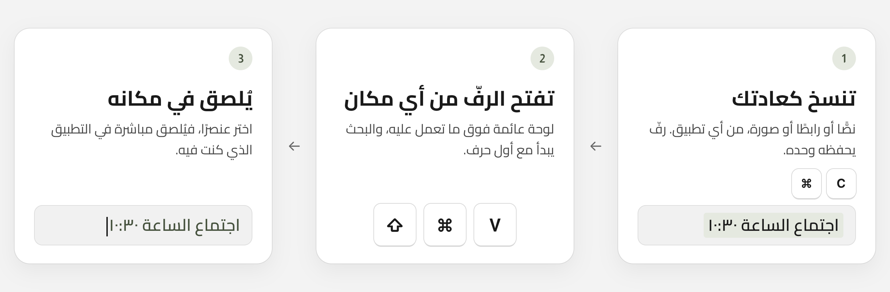
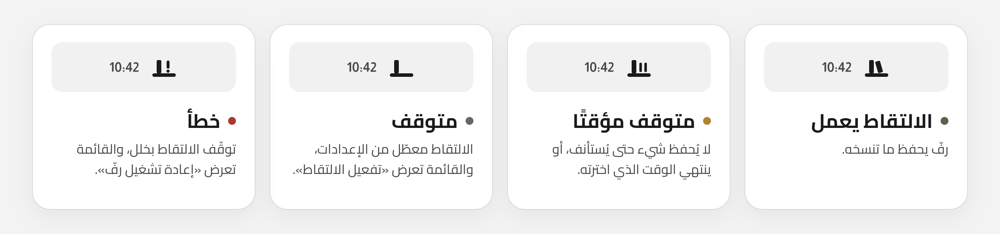
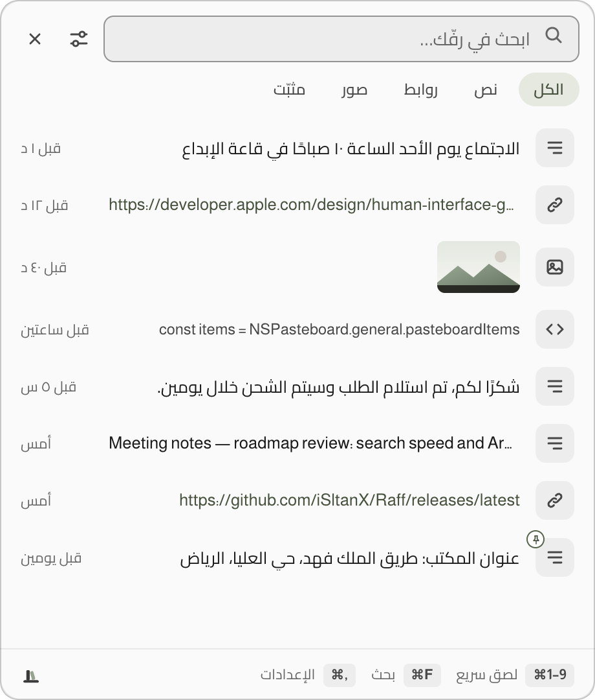
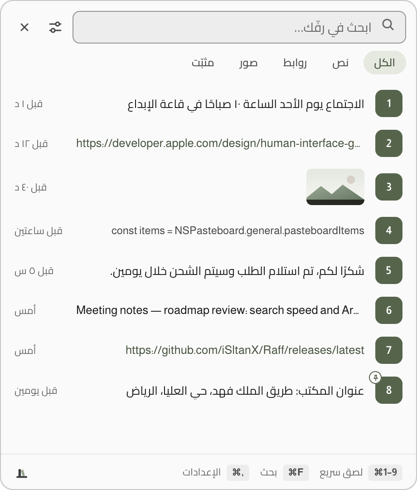
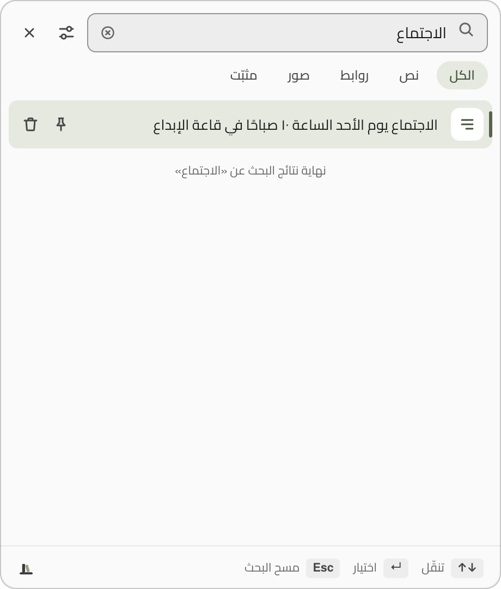
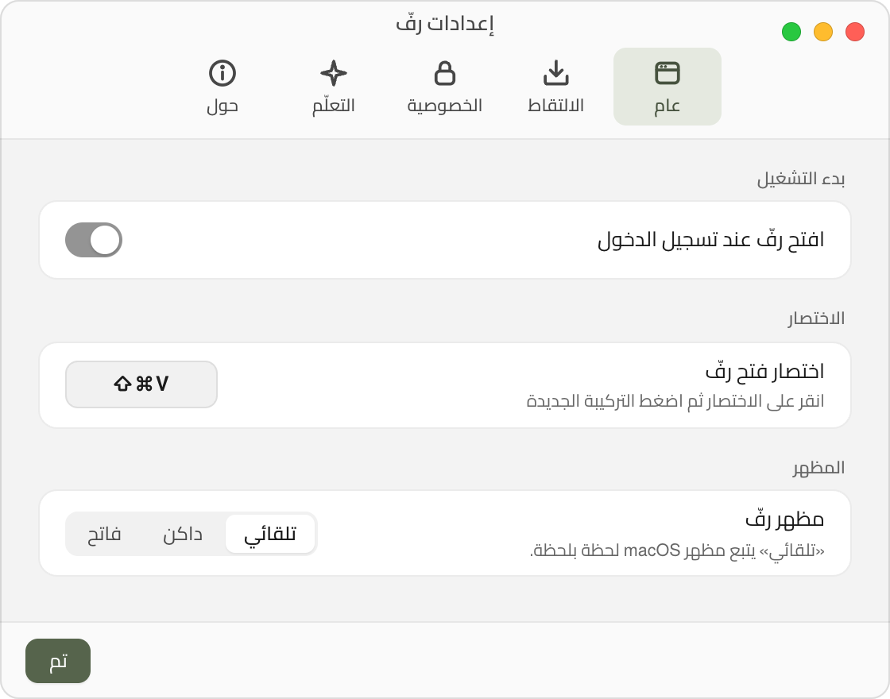
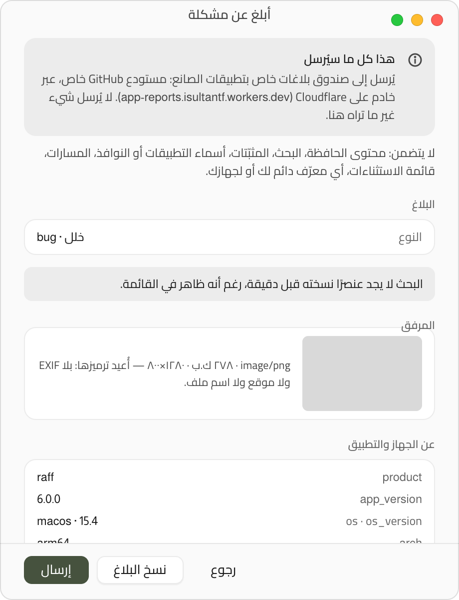
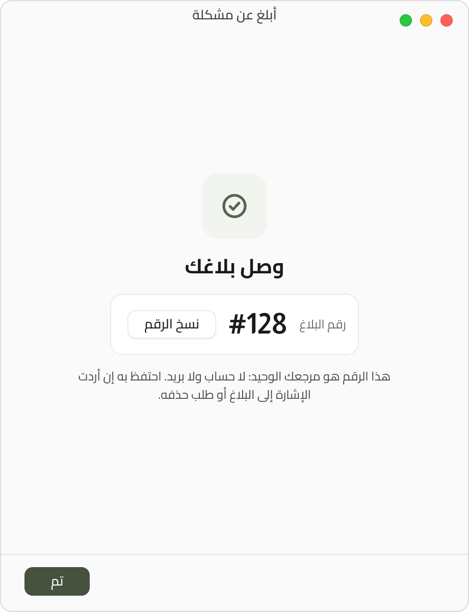
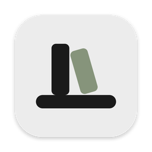

<div dir="rtl">

<div align="center">

<picture>
  <source media="(prefers-color-scheme: dark)" srcset="docs/assets/header-ar-dark.png">
  
</picture>

[](https://github.com/iSltanX/Raff/releases/latest)
[](#المتطلبات)
[](#الخصوصية)
[](#الميزات)

### [⬇︎ تنزيل أحدث إصدار](https://github.com/iSltanX/Raff/releases/latest)

<sub>مجاني · macOS 12 أو أحدث · Apple Silicon</sub>

[الفكرة](#الفكرة) · [طريقة العمل](#طريقة-العمل) · [الميزات](#الميزات) · [التثبيت](#التثبيت) · [الاستخدام](#الاستخدام) · [لقطات الشاشة](#لقطات-الشاشة) · [الخصوصية](#الخصوصية) · [الأسئلة المتكررة](#الأسئلة-المتكررة)

</div>

---

## الفكرة

تنسخ رابطًا، ثم فقرة، ثم صورة، وحين تحتاج الرابط الأول تجده قد ضاع. الحافظة في macOS تحفظ شيئًا واحدًا فقط.

**رفّ** مدير حافظة عربي يسكن شريط القوائم: يحفظ كل ما تنسخه تلقائيًا، ويعيده إليك بضغطة واحدة من أي تطبيق. ويرتّبه في طبقتين:

| الطبقة | ما فيها |
| --- | --- |
| **الأخير** | سجل تلقائي لكل ما نسخته: نصوص وروابط وشفرات وصور. |
| **المثبّت** | ما تختار إبقاءه دائمًا، ولا يُحذف مهما طال السجل. |

<sub>رمز رفّ يرسم الفكرة نفسها: عنصر قائم هو «المثبّت»، وبطاقة تستند إليه هي «الأخير».</sub>

---

## طريقة العمل

<picture>
  <source media="(prefers-color-scheme: dark)" srcset="docs/assets/steps-ar-dark.png">
  
</picture>

اختيار عنصر ينسخه، ويغلق اللوحة، ويلصقه في التطبيق الذي كنت فيه. وإن أمسكت <kbd>⌘</kbd> ظهرت أرقام أول تسعة عناصر، فتلصق أيًّا منها بـ <span dir="ltr"><kbd>⌘</kbd><kbd>1</kbd></span> إلى <span dir="ltr"><kbd>⌘</kbd><kbd>9</kbd></span> دون أن تبحث.

---

## الميزات

- **سريع من اللحظة الأولى.** اللوحة تفتح فورًا بـ <span dir="ltr"><kbd>⇧</kbd><kbd>⌘</kbd><kbd>V</kbd></span> أو بنقرة على أيقونة شريط القوائم، والبحث يصفّي أثناء الكتابة.
- **بحث عربي.** يتجاهل التشكيل والتطويل، فتجد «مُحَمَّد» حين تكتب «محمد».
- **لصق بلا تنسيق.** <span dir="ltr"><kbd>⌥</kbd><kbd>⏎</kbd></span> يلصق العنصر نصًّا عاديًا.
- **خاص بالكامل.** بلا حساب ولا سحابة ولا تتبّع. ما تنسخه لا يغادر جهازك.
- **يتجاهل كلمات المرور.** ما يعلّمه مديرو كلمات المرور محتوى سرّيًا لا يُحفظ أصلًا.
- **تحت سيطرتك.** استثنِ تطبيقات بعينها، أو أوقف الالتقاط مؤقتًا، أو حدّد مدة الاحتفاظ بالسجل.
- **يقول لك حين لا يحفظ.** أيقونة شريط القوائم تتغيّر مع حالة الالتقاط، واللوحة والإعدادات تعرض السبب وزرًّا واحدًا يعالجه.
- **أبلغ عن مشكلة من داخل رفّ.** اكتب ما حدث وأرفق صورة إن شئت، وراجع كل ما سيُرسل قبل أن تؤكّد، ثم يظهر لك رقم البلاغ. وإن انقطع الاتصال: «إعادة المحاولة» دون أن يتكرر البلاغ، أو «نسخ البلاغ» لتلصقه حيث تشاء.
- **عربي أصيل.** واجهة من اليمين إلى اليسار من الأساس، ووضعان فاتح وداكن يتبعان النظام.

### أيقونة شريط القوائم

<picture>
  <source media="(prefers-color-scheme: dark)" srcset="docs/assets/menubar-states-ar-dark.png">
  
</picture>

الأيقونة نفسها تقول هل يحفظ رفّ ما تنسخه الآن. وقائمتها تبدأ بسطر الحالة، وتعرض الحل حين يلزم: «تفعيل الالتقاط» أو «إعادة تشغيل رفّ».

---

## التثبيت

1. نزّل ملف `Raff_…_aarch64.dmg` من [صفحة الإصدارات](https://github.com/iSltanX/Raff/releases/latest).
2. افتحه واسحب **Raff** إلى مجلد **التطبيقات**.
3. شغّل رفّ، وستجد أيقونته في **شريط القوائم**.
4. نافذة الترحيب تعرّفك برفّ في خمس خطوات: الفكرة، وطريقة الفتح، ثم تقول لك إن رفّ يلتقط الآن وتسألك: **أبقِه يعمل** أو **أوقفه**. بعدها إذن **تسهيلات الاستخدام** اختياريًا (للّصق التلقائي فقط)، وأخيرًا ملخّص لما اخترته.

</div>

> [!IMPORTANT]
> **تنبيه Gatekeeper:** رفّ موقَّع ذاتيًا ولم يمرّ بتوثيق Apple (Notarization)، لأنه مشروع شخصي. لذلك قد يرفض macOS فتحه أول مرة.
>
> - **في macOS 15 فما بعد:** حاول فتحه مرة، ثم افتح **إعدادات النظام ← الخصوصية والأمن** واضغط **افتح على أي حال**.
> - **في macOS 12 إلى 14:** في Finder انقر على Raff بالزر الأيمن ← **فتح** ← **فتح**.
>
> تكفي مرة واحدة. وإن استمر المنع، فمن الطرفية:
> ```sh
> xattr -dr com.apple.quarantine /Applications/Raff.app
> ```

<div dir="rtl">

### المتطلبات

- نظام macOS 12 (Monterey) أو أحدث، ومُختبَر حتى **macOS 27**.
- معالج **Apple Silicon**. لا توجد نسخة لمعالجات Intel.

### الصلاحية

صلاحية واحدة: **تسهيلات الاستخدام** (Accessibility)، لمحاكاة <span dir="ltr"><kbd>⌘</kbd><kbd>V</kbd></span> عند اللصق. بدونها يبقى كل شيء يعمل، ويُنسخ العنصر إلى الحافظة لتلصقه بنفسك.

---

## الاستخدام

| الإجراء | المفتاح |
| --- | --- |
| فتح اللوحة وإغلاقها من أي مكان | <span dir="ltr"><kbd>⇧</kbd><kbd>⌘</kbd><kbd>V</kbd></span>، ويمكن تغييره من الإعدادات |
| لصق العنصر المحدد | <kbd>⏎</kbd> |
| لصق كنص عادي بلا تنسيق | <span dir="ltr"><kbd>⌥</kbd><kbd>⏎</kbd></span> |
| لصق سريع لأحد أول تسعة عناصر | <span dir="ltr"><kbd>⌘</kbd><kbd>1</kbd></span> … <span dir="ltr"><kbd>⌘</kbd><kbd>9</kbd></span> |
| نسخ دون لصق | <span dir="ltr"><kbd>⌘</kbd><kbd>C</kbd></span> |
| تثبيت العنصر أو إلغاء تثبيته | <span dir="ltr"><kbd>⌥</kbd><kbd>P</kbd></span> |
| حذف العنصر، ثم التراجع خلال 5 ثوانٍ | <span dir="ltr"><kbd>⌘</kbd><kbd>⌫</kbd></span> ثم <span dir="ltr"><kbd>⌘</kbd><kbd>Z</kbd></span> |
| البحث | اكتب مباشرة، أو <span dir="ltr"><kbd>⌘</kbd><kbd>F</kbd></span> |
| مسح البحث، ثم الإغلاق | <kbd>Esc</kbd> |

- النقر على عنصر يلصقه، والنقر مع <kbd>⌥</kbd> يلصقه نصًّا عاديًا.
- النقر على أيقونة شريط القوائم يفتح اللوحة، والنقر الأيمن يفتح القائمة: سطر الحالة، و«فتح رفّ»، و«الالتقاط» (الإيقاف المؤقت والاستئناف)، و«الإعدادات…»، و«التحقق من التحديثات…»، و«أبلغ عن مشكلة…»، و«عن رفّ».
- «عن رفّ» يعرض الإصدار، ويتحقق من التحديثات، ويفتح «أبلغ عن مشكلة…».
- التحديثات تصل من إصدارات هذا المستودع في نافذة واحدة تعرض التحقق والتنزيل والتثبيت وإعادة التشغيل. كل حزمة موقَّعة، ويرفض التطبيق ما لا يطابق توقيعه.

---

## لقطات الشاشة

<table>
  <tr>
    <td width="50%" align="center" valign="top">
      <picture>
        <source media="(prefers-color-scheme: dark)" srcset="docs/assets/raff-panel-dark.png">
        
      </picture><br>
      <b>اللوحة</b><br>
      الأخير والمثبّت في مكان واحد، فوق ما تعمل عليه.
    </td>
    <td width="50%" align="center" valign="top">
      <picture>
        <source media="(prefers-color-scheme: dark)" srcset="docs/assets/raff-quick-paste-dark.png">
        
      </picture><br>
      <b>اللصق السريع</b><br>
      أمسك <kbd>⌘</kbd> لتظهر أرقام أول تسعة عناصر.
    </td>
  </tr>
  <tr>
    <td width="50%" align="center" valign="top">
      <picture>
        <source media="(prefers-color-scheme: dark)" srcset="docs/assets/raff-search-dark.png">
        
      </picture><br>
      <b>البحث</b><br>
      النتائج تتصفّى أثناء الكتابة، في النصوص والروابط والصور.
    </td>
    <td width="50%" align="center" valign="top">
      <picture>
        <source media="(prefers-color-scheme: dark)" srcset="docs/assets/raff-settings-dark.png">
        
      </picture><br>
      <b>الإعدادات</b><br>
      عام، والالتقاط وحالته، والخصوصية، والتعلّم، وحول.
    </td>
  </tr>
  <tr>
    <td width="50%" align="center" valign="top">
      <picture>
        <source media="(prefers-color-scheme: dark)" srcset="docs/assets/raff-report-dark.png">
        
      </picture><br>
      <b>أبلغ عن مشكلة</b><br>
      ترى كل ما سيُرسل قبل أن تؤكّد: الوصف، والصورة، ومعلومات التشخيص.
    </td>
    <td width="50%" align="center" valign="top">
      <picture>
        <source media="(prefers-color-scheme: dark)" srcset="docs/assets/raff-report-sent-dark.png">
        
      </picture><br>
      <b>رقم البلاغ</b><br>
      مرجعك الوحيد، بلا حساب ولا بريد.
    </td>
  </tr>
</table>

---

## الخصوصية

- **ما تنسخه لا يغادر جهازك.** لا يرسل رفّ شيئًا من حافظتك إلى أي مكان.
- **الشبكة لأمرين فقط:** التحقق من التحديثات، وبلاغ عن مشكلة تكتبه أنت وترى كل ما فيه قبل أن تؤكّد إرساله.
- **البلاغ باختيارك وحدك:** لا يُرسل شيء قبل أن تضغط «إرسال»، وما تراه في المعاينة هو ما يُرسل حرفًا بحرف، ومعه معلومات التشخيص نفسها.
- **التشخيص بلا محتوى:** إصدار رفّ وmacOS، وحالة الالتقاط والإذن، وإعدادات عامة وأعداد. لا شيء من حافظتك، ولا أسماء تطبيقات أو ملفات.
- **الصورة تُعاد كتابتها قبل الإرسال،** فتسقط بياناتها الوصفية (EXIF والموقع) واسم الملف.
- **لا حساب، ولا مزامنة، ولا تتبّع، ولا تقارير أعطال تلقائية.**
- **تخزين محلي تفهمه:** ملفات JSON وصور PNG في <span dir="ltr">`~/Library/Application Support/com.raff.app/`</span>، تفتحها أو تحذفها متى شئت.
- **المحتوى السرّي والمؤقت لا يُحفظ،** والتطبيقات المستبعَدة لا يُلتقط ما يُنسخ منها وهي في الواجهة.
- **التعلّم اختياري ومحلي:** يعدّ رفّ مرات نسخ كل عنصر ولصقه، على هذا الجهاز فقط. تعرض العدّادات وتمسحها وتوقفها من الإعدادات.

التفاصيل كاملة — ما يُحفظ، وما يُرسل في البلاغ حقلًا حقلًا، وأين يُحفظ وكيف يُحذف — في [سياسة الخصوصية](PRIVACY.md).

---

## الأسئلة المتكررة

<details>
<summary><strong>لماذا يحذّرني macOS حين أفتحه أول مرة؟</strong></summary><br>

لأن رفّ موقَّع ذاتيًا لا بشهادة Apple Developer ID، ولم يمرّ بتوثيق Apple. طريقة الفتح في [التثبيت](#التثبيت)، وتكفي مرة واحدة.
</details>

<details>
<summary><strong>هل يحفظ كلمات المرور التي أنسخها؟</strong></summary><br>

لا. مديرو كلمات المرور يعلّمون ما ينسخونه بأنه سرّي أو مؤقت، ورفّ يتجاهل هذا المحتوى تلقائيًا فلا يدخل السجل.
</details>

<details>
<summary><strong>كم عنصرًا يحفظ، وإلى متى؟</strong></summary><br>

200 أو 500 أو 1000 عنصر، والافتراضي 500. ومدة الاحتفاظ بلا حدّ، أو أسبوع، أو شهر، أو ثلاثة أشهر. العناصر المثبّتة لا تُحذف تلقائيًا أبدًا.
</details>

<details>
<summary><strong>كيف أوقفه مؤقتًا؟</strong></summary><br>

النقر الأيمن على أيقونة شريط القوائم ← **الالتقاط**: «تجاهل النسخة التالية»، أو «إيقاف ١٥ دقيقة»، أو «إيقاف ساعة»، أو «إيقاف حتى إعادة التشغيل». تتغير الأيقونة ما دام الإيقاف قائمًا، والإيقاف المؤقت ينتهي في موعده وحده، و«استئناف الالتقاط» يعيده متى شئت.
</details>

<details>
<summary><strong>لماذا يطلب تسهيلات الاستخدام؟</strong></summary><br>

ليلصق العنصر في التطبيق الذي كنت فيه، بمحاكاة <span dir="ltr"><kbd>⌘</kbd><kbd>V</kbd></span>. إن لم تمنحها، يُنسخ العنصر إلى الحافظة وتلصقه أنت.
</details>

<details>
<summary><strong>هل يعمل على معالجات Intel؟</strong></summary><br>

لا. الإصدارات مبنية لـ Apple Silicon فقط.
</details>

<details>
<summary><strong>كيف أزيله تمامًا؟</strong></summary><br>

1. أنهِ رفّ من قائمة أيقونته.
2. احذف **Raff** من مجلد التطبيقات.
3. احذف مجلد البيانات: <span dir="ltr">`~/Library/Application Support/com.raff.app/`</span>
4. إن فعّلت التشغيل عند الدخول، احذف <span dir="ltr">`~/Library/LaunchAgents/Raff.plist`</span>
5. أزل «رفّ» من **إعدادات النظام ← الخصوصية والأمن ← تسهيلات الاستخدام**.
</details>

---

## للمطوّرين

<details>
<summary><b>البناء من المصدر</b></summary><br>

**المتطلبات:** Rust (stable)، وNode 20 أو أحدث، وأدوات سطر أوامر Xcode.

| الأمر | ما يفعله |
| --- | --- |
| <span dir="ltr">`npm install`</span> | يثبّت الاعتماديات |
| <span dir="ltr">`npm run tauri dev`</span> | تشغيل تطويري |
| <span dir="ltr">`npm run tauri build`</span> | يبني <span dir="ltr">`Raff.app`</span> وملف DMG |
| <span dir="ltr">`npm test`</span> | اختبارات الواجهة |
| <span dir="ltr">`cargo test --manifest-path src-tauri/Cargo.toml`</span> | اختبارات الخلفية |

الواجهة HTML وCSS وJavaScript بلا إطار، والخلفية Rust على Tauri 2. الإصدارات تُبنى عبر GitHub Actions عند دفع وسم بصيغة <span dir="ltr">`vX.Y.Z`</span>، وسجل التغييرات في [CHANGELOG.md](CHANGELOG.md).
</details>

## الإبلاغ عن مشكلة

**من داخل رفّ:** «أبلغ عن مشكلة…» من قائمة أيقونة شريط القوائم، أو من نافذة **عن رفّ**، أو من **الإعدادات ← حول**.

1. اختر نوع البلاغ واكتب ما حدث، وأرفق صورة واحدة إن شئت: من ملف بـ «اختر صورة…» أو بلصقها في النافذة.
2. «التالي: المعاينة» يعرض البلاغ كاملًا — ومعه معلومات التشخيص حقلًا حقلًا — قبل أن ترسله.
3. «إرسال» يوصله إلى صندوق بلاغات خاص لا يراه غير المطوّر، ويظهر لك **رقم البلاغ**.
4. إن تعذّر الاتصال: «إعادة المحاولة» ترسل البلاغ نفسه فلا يُسجَّل مرتين، و«نسخ البلاغ» يضعه على حافظتك.

التفاصيل في [سياسة الخصوصية](PRIVACY.md#الإبلاغ-عن-مشكلة).

**أو علنًا:** افتح مسألة في [صفحة المسائل](https://github.com/iSltanX/Raff/issues)، واذكر: إصدار رفّ (من **الإعدادات ← حول**)، وإصدار macOS، وخطوات إعادة المشكلة. يمكنك لصق ما ينسخه «نسخ» بجوار **معلومات التشخيص** في الإعدادات.

</div>

> [!CAUTION]
> لا ترفق محتوى حافظة خاصًّا. ما تكتبه في المسألة يصير علنيًّا.

<div dir="rtl">

## الرخصة

جميع الحقوق محفوظة. «رفّ» وهويته البصرية عمل شخصي غير مرخَّص للاستخدام أو إعادة التوزيع دون إذن.

---

<div align="center">



**تصميم وتطوير: سلطان** · Designed & developed by Sultan

الموقع: [bysltan.com](https://www.bysltan.com)

للتواصل: [S@BySltan.com](mailto:S@BySltan.com)

من الصانع نفسه<br>
تطبيقات macOS: [بدّل](https://github.com/iSltanX/Baddel) · [Luma](https://github.com/iSltanX/Luma) · [نفّذ](https://github.com/iSltanX/naffith)<br>
إضافات المتصفح: [SnRead](https://github.com/iSltanX/SnRead) · [صَوْب](https://github.com/iSltanX/SAWB) · [جسور](https://github.com/iSltanX/Jusoor)

<sub>[سجل التغييرات](CHANGELOG.md) · [الإصدارات](https://github.com/iSltanX/Raff/releases)</sub>

</div>

</div>
